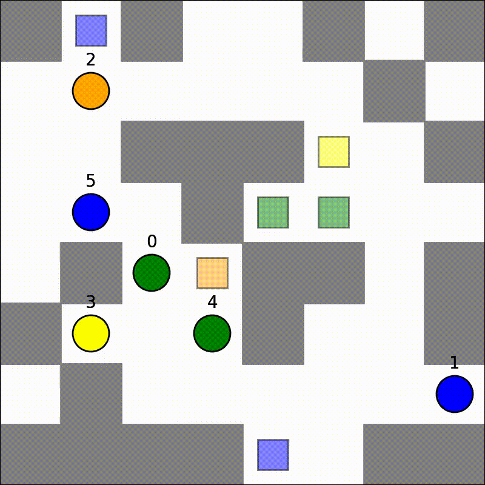
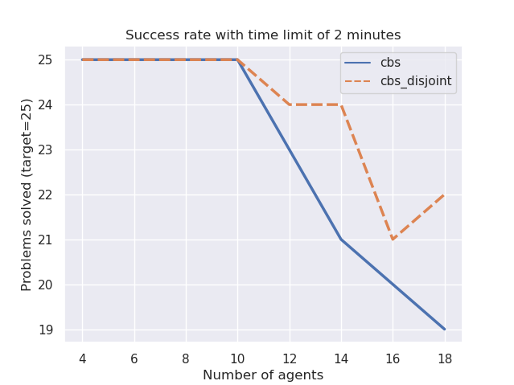
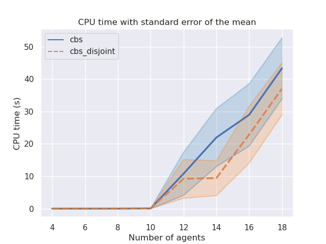
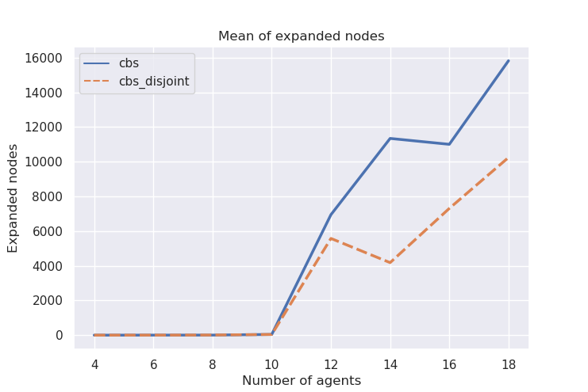
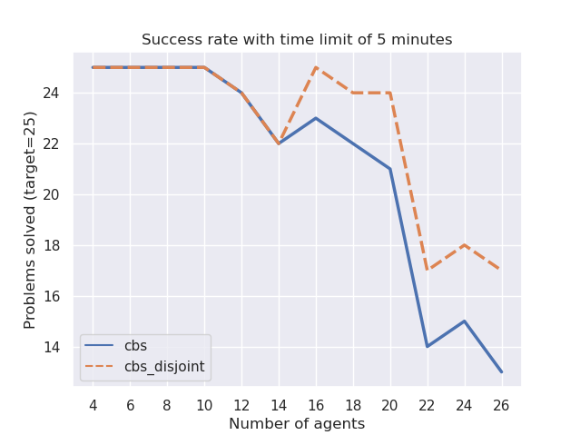
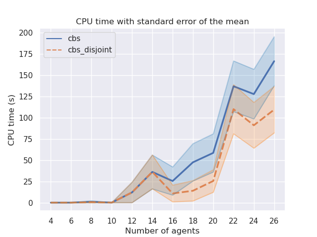

# Multi-Agent Path Finding (MAPF)
The MAPF (Multi-Agent Path Finding) is the problem of computing collision-free paths for a team of agents from their current locations to a given destination. In this repo you can find the solution of the assignment given by [Sven Koenig](http://idm-lab.org/project-p/project.html) that is composed of 5 tasks. I used the repository of [jzagoli](https://github.com/jzagoli) that has already implemented the tasks 1 to 3 included. Try the solution executing the following command (after installing requirements.txt):

```bash
python run_experiments.py --disjoint --random --solver CBS
```
<p align="center">
    
</p>

### Task 4
The target of this task is to implement the CBS (Conflict-Based Search) with Disjoint Splitting, that means (in a few words)
to add the support of positive contraints to the CBS algorithm. The CBS algorithm use the negative contraints to
indicate conflicts between agents, the idea of the positive contraints is to force agents to be in a certain position
in the specified time.

### Task 5
In this task I will benchmark the performance of MAPF solvers, I chose to make a custom benchmark that is
based on some random maps generated at runtime.

In my solution there are the following steps:
- Generate a random map
- Solve the map with the MAPF solver (CBS and CBS+DS)
- Increase the number of agents and repeat the process

#### 1 - Benchmark random
The benchmark is based on random maps generated at runtime with a number of agents that varies from 4 to 18 with a step of 2. For each number of agents the benchmark generate 25 maps and solve them with the MAPF solver. The time limit is set to 2 minutes and every cell of the map has the probability of 5% of being occupied.
The benchmark is executed with the following command (it can take hours to finish):
```bash
python run_experiments.py --benchmark random
```
After the execution you can see the results in the following command:
```bash
python plot_benchmark.py --plot random
```
A possible output is the following:
<p align="center">
    
    
    
</p>

#### 2 - Benchmark success
In this benchmark the map is a 20x20 matrix with obstacles distributed in the 5% of the map. The idea is to increase the number of agents (from 4 to 26 with step 2) and see if the algoritm can solve the problem in less than 5 minutes. For each number of agents the same map is used for 25 times, but the start and goal positions are randomly distributed (idea taken from this [paper](http://idm-lab.org/bib/abstracts/papers/icaps19a.pdf)).
To run this benchmark you need to launch the following command:

```bash
python run_experiments.py --benchmark success
```
When the benchmark is finished (it can take more then one hour) you can see the plots by typing the following command:
```bash
python plot_benchmark.py --plot success
```
<p align="center">
    
    
</p>

### Conclusion
As plotted, the algorithm CBS-DS runs much faster than the CBS algorithm and the number of nodes expanded is smaller. So the benchmark verified that the CBS-DS algorithm seems to be more efficient than the CBS as written on the assignment "...CBS with disjoint splitting can be expected to run faster than CBS" ([handout.pdf](pdf/handout.pdf)).